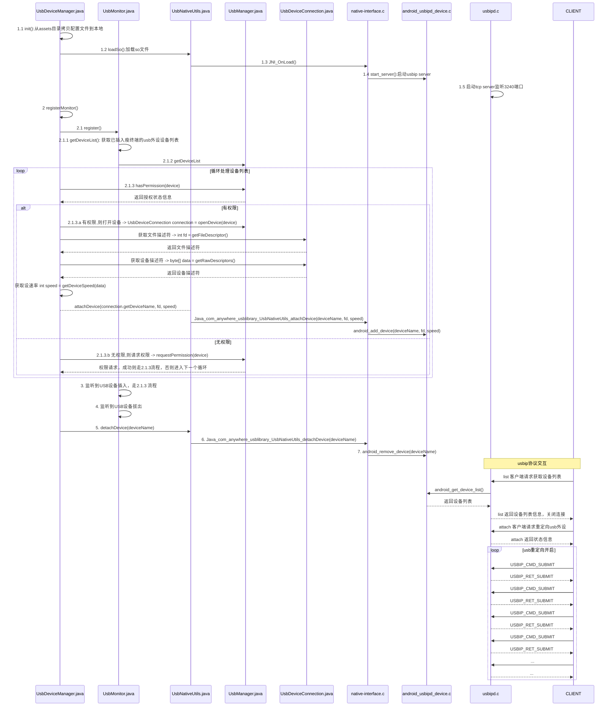

```mermaid
sequenceDiagram

participant UDM as UsbDeviceManager.java
participant UM as UsbMonitor.java
participant UNU as UsbNativeUtils.java
participant UMR as UsbManager.java
participant UDC as UsbDeviceConnection.java
participant NI as native-interface.c
participant NAUD as android_usbipd_device.c
participant NAUD as android_usbipd_device.c
participant USBIPD as usbipd.c
participant CLIENT 


UDM ->> UDM: 1.1 init():从assets目录拷贝配置文件到本地
UDM ->> UNU: 1.2 loadSo():加载so文件
UNU ->> NI:  1.3 JNI_OnLoad()
NI ->> NAUD:  1.4 start_server():启动usbip server
USBIPD ->> USBIPD: 1.5 启动tcp server监听3240端口
 
UDM ->> UDM: 2 registerMonitor()
UDM ->> UM: 2.1 register()
UM ->> UM: 2.1.1 getDeviceList(): 获取已插入瘦终端的usb外设设备列表
UM ->> UMR: 2.1.2 getDeviceList
loop 循环处理设备列表
UDM ->> UMR:2.1.3 hasPermission(device)
UMR -->> UDM:  返回授权状态信息
alt 有权限
UDM ->> UMR: 2.1.3.a 有权限,则打开设备 -> UsbDeviceConnection connection = openDevice(device)
UDM ->> UDC: 获取文件描述符 -> int fd = getFileDescriptor()
UDC -->> UDM: 返回文件描述符

UDM ->> UDC: 获取设备描述符 -> byte[] data = getRawDescriptors()
UDC -->> UDM: 返回设备描述符

UDM ->> UDM: 获取设速率 int speed = getDeviceSpeed(data)
UDM --> UNU: attachDevice(connection.getDeviceName, fd, speed)

UNU ->> NI: Java_com_anywhere_usblibrary_UsbNativeUtils_attachDevice(deviceName, fd, speed)
NI ->> NAUD: android_add_device(deviceName, fd, speed)
else 无权限
UDM ->> UMR: 2.1.3.b 无权限,则请求权限 -> requestPermission(device)
UMR -->>UDM: 权限请求，成功则走2.1.3流程，否则进入下一个循环
end
end

UM ->> UM: 3. 监听到USB设备插入，走2.1.3 流程
UM ->> UM: 4. 监听到USB设备拔出
UDM ->> UNU: 5. detachDevice(deviceName)
UNU ->> NI: 6. Java_com_anywhere_usblibrary_UsbNativeUtils_detachDevice(deviceName)
NI ->> NAUD: 7. android_remove_device(deviceName)


Note over CLIENT, USBIPD: usbip协议交互

CLIENT ->> USBIPD: list 客户端请求获取设备列表

USBIPD ->> NAUD: android_get_device_list()

NAUD -->> USBIPD: 返回设备列表

USBIPD -->> CLIENT: list 返回设备列表信息，关闭连接

CLIENT ->> USBIPD: attach 客户端请求重定向usb外设
USBIPD -->> CLIENT: attach 返回状态信息

loop usb重定向开启
CLIENT ->> USBIPD: USBIP_CMD_SUBMIT
USBIPD -->> CLIENT: USBIP_RET_SUBMIT
CLIENT ->> USBIPD: USBIP_CMD_SUBMIT
USBIPD -->> CLIENT: USBIP_RET_SUBMIT
CLIENT ->> USBIPD: USBIP_CMD_SUBMIT
USBIPD -->> CLIENT: USBIP_RET_SUBMIT
CLIENT ->> USBIPD: USBIP_CMD_SUBMIT
USBIPD -->> CLIENT: USBIP_RET_SUBMIT
CLIENT ->> USBIPD: ...
USBIPD -->> CLIENT: ...
end
```
